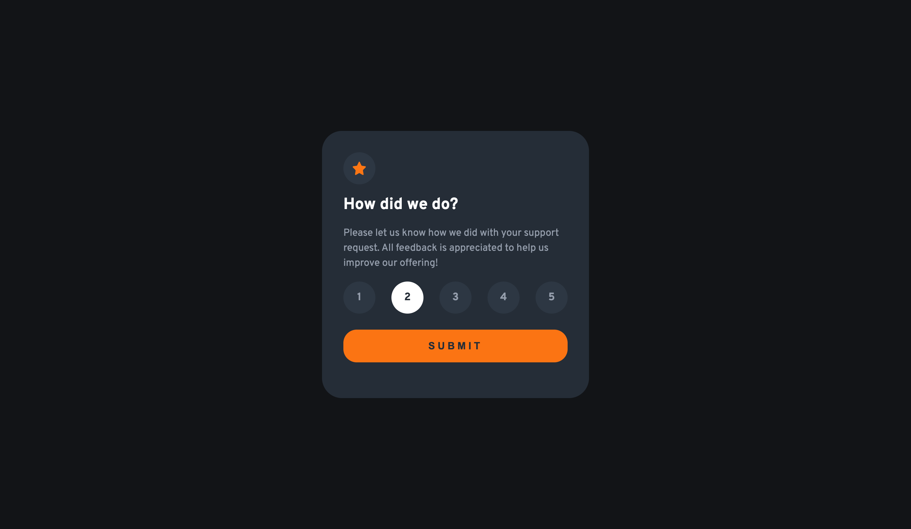
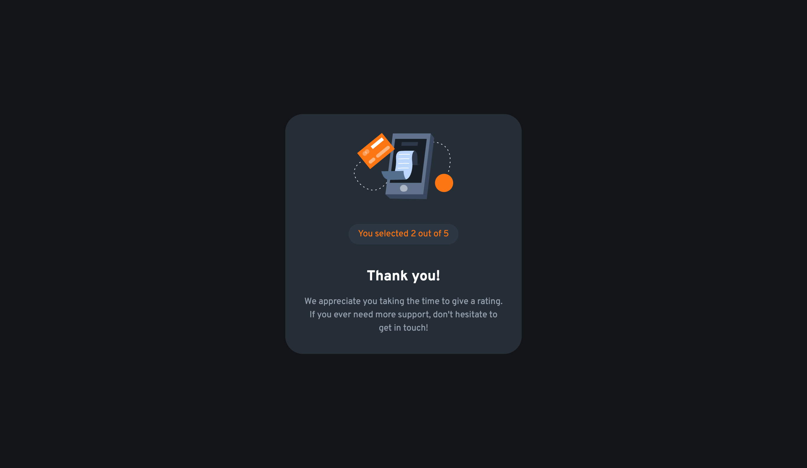
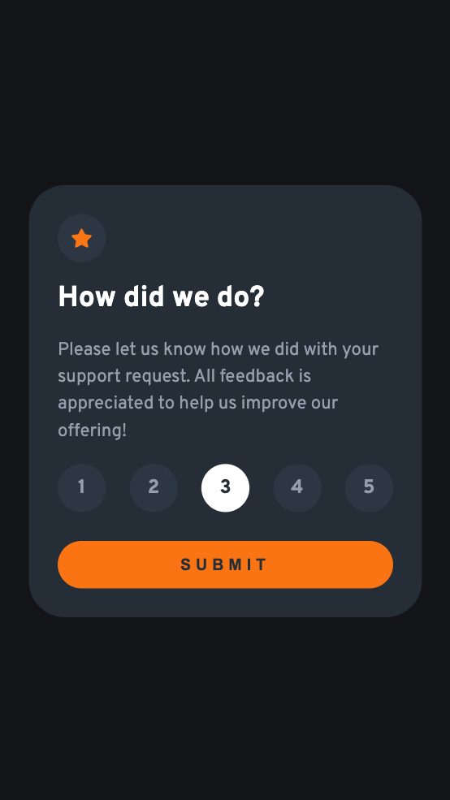
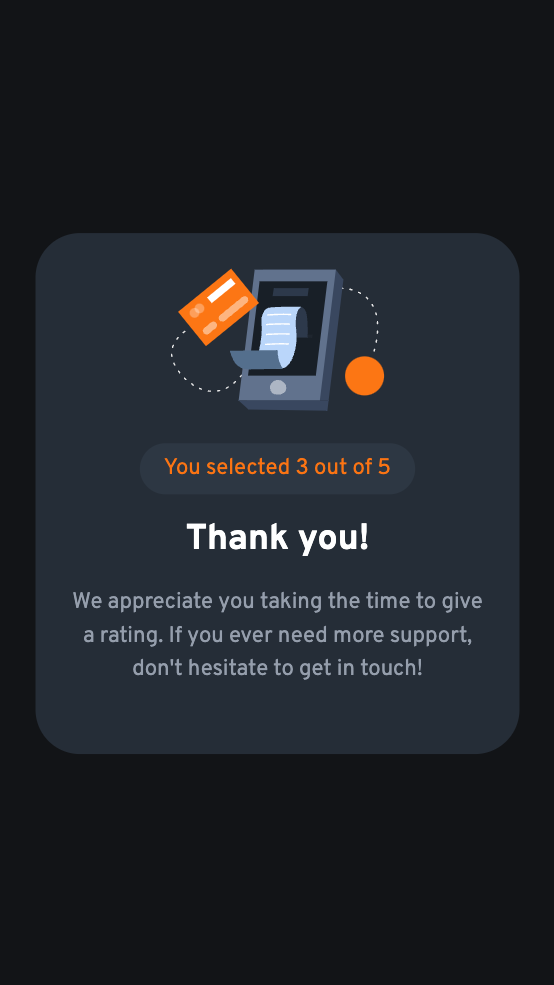

# Frontend Mentor - Interactive rating component solution

This is a solution to the [Interactive rating component challenge on Frontend Mentor](https://www.frontendmentor.io/challenges/interactive-rating-component-koxpeBUmI).

## Table of contents

- [Overview](#overview)
  - [The challenge](#the-challenge)
  - [Screenshot](#screenshot)
  - [Links](#links)
- [My process](#my-process)
  - [Built with](#built-with)
  - [What I learned](#what-i-learned)

## Overview

### The challenge

Users should be able to:

- View the optimal layout for the app depending on their device's screen size
- See hover states for all interactive elements on the page
- Select and submit a number rating
- See the "Thank you" card state after submitting a rating
- See animated transition between states

### Screenshot

#### Desktop View




#### Mobile View




### Links

- Solution URL:[GitHub](https://github.com/Natata08/rating-component)
- Live Site URL: [Add live site URL here]

## My process

### Built with

- [React](https://reactjs.org/) - JS library
- [Vite](https://vite.dev/) - Build tool
- [Framer Motion](https://www.framer.com/motion/) - Animation library
- CSS Modules
- Mobile-first workflow
- Semantic HTML5
- CSS Custom Properties
- Flexbox

### What I learned

- Implementing mobile-first responsive design:

```css
.card {
  /* Mobile styles first */
  padding: var(--spacing-16);

  /* Tablet and up */
  @media (min-width: 768px) {
    padding: var(--spacing-32);
  }
}
```

- Adding animations with Framer Motion:

```jsx
<AnimatePresence mode='wait'>
  <motion.div
    variants={cardVariants}
    initial='initial'
    animate='animate'
    exit='exit'
  >
    {/* Card content */}
  </motion.div>
</AnimatePresence>
```
